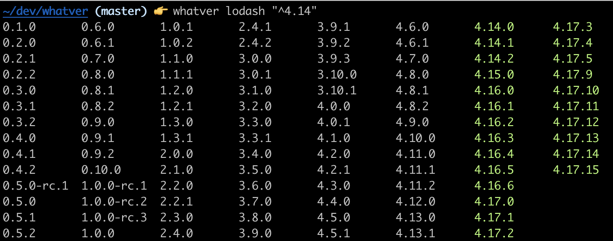

# whatver

A simple Node.js cli tool for checking semver ranges of npm packages, similar to [https://semver.npmjs.com/](https://semver.npmjs.com/), but in the comfort of your terminal. 

As well as checking package versions on the registry, it will also display the currently installed package version in your `node_modules` and the semver range from `package.json`.



## Installation

```bash
# For CLI usage
npm install -g whatver
# or
npx whatver

# For library usage  
npm install whatver
```

## CLI Usage

### Basic Usage
```bash
# Show all stable versions of a package (excludes prerelease by default)
npx whatver lodash

# Show versions matching a specific range
npx whatver lodash "^4.14"

# Include prerelease versions (alpha, beta, rc, etc.)
npx whatver lodash --show-prerelease
```

### Local Package Detection

When run in a directory with a package.json, whatver automatically detects local packages:

```bash
# In a project with lodash in package.json
npx whatver lodash
# Automatically uses the semver range from your package.json
# Shows installed version with visual indicators

# Override with specific range
npx whatver lodash "^4.0.0"

# Show all versions with local range highlighted
npx whatver lodash --all

# Include prerelease versions in local package analysis
npx whatver lodash --show-prerelease
```

### Version Filtering

By default, whatver excludes prerelease versions (alpha, beta, rc, etc.) to show only stable releases. Use `--show-prerelease` to include prerelease versions when needed.

## Library Usage

### List all versions and whether the semver range is satisfied for that version.

```typescript
import { allPackageVersions, type PackageVersionInfo, type PackageVersionOptions } from "whatver";

// Get stable versions only (default behavior)
const versionInfo: PackageVersionInfo[] = await allPackageVersions("lodash", "^4.14");
// Returns: [
//   { version: "4.14.0", satisfied: true },
//   { version: "4.15.0", satisfied: true },
//   { version: "3.10.1", satisfied: false },
//   ...
// ]
console.log(versionInfo);

// Include prerelease versions
const options: PackageVersionOptions = { showPrerelease: true };
const allVersions = await allPackageVersions("lodash", "^4.14", options);
// Also includes versions like "4.15.0-beta.1", "4.16.0-alpha.1", etc.
```

### List only versions that satisfy the semver range

```typescript
import { satisfiedPackageVersions, type PackageVersionOptions } from "whatver";

// Get satisfied stable versions only (default)
const satisfied: string[] = await satisfiedPackageVersions("lodash", "^4.14");
// Returns: ["4.14.0", "4.14.1", "4.15.0", "4.16.0", ...]
console.log(satisfied);

// Include prerelease versions that satisfy the range
const options: PackageVersionOptions = { showPrerelease: true };
const withPrerelease = await satisfiedPackageVersions("lodash", "^4.14", options);
// Also includes "4.15.0-beta.1", "4.16.0-alpha.1", etc. if they satisfy ^4.14
```

### TypeScript Types

```typescript
import type { PackageVersionInfo, PackageVersionOptions } from "whatver";

// Interface for version results
interface PackageVersionInfo {
  version: string;
  satisfied: boolean;
}

// Interface for options
interface PackageVersionOptions {
  showPrerelease?: boolean;
}
```

### Error Handling

```typescript
import { allPackageVersions } from "whatver";

try {
  const versions = await allPackageVersions("nonexistent-package", "^1.0.0");
} catch (error) {
  console.error(error.message);
  // "Failed to fetch package versions: Package 'nonexistent-package' not found in npm registry"
}

try {
  const versions = await allPackageVersions("lodash", "invalid-semver");
} catch (error) {
  console.error(error.message);
  // "Invalid semver range: invalid-semver"
}
```

## Development

This project uses [Bun](https://bun.com/) and [devbox](https://www.jetify.com/docs/devbox/) (optional) for development:


```bash
# Installs bun to isolated env & enters it (optional)
devbox install
devbox shell

# install dependenices
bun install

# run cli
bun run src/cli.ts

# run tests
bun test

# type checking
bun type-check

# check linting and formatting
bun check
```

## Releasing

```bash
# Test release process (dry run)
bun run release:dry

# Interactive release (choose version)
bun run release
```

The release process will:
- Run tests and linting checks
- Build the project
- Update the version in package.json
- Create a git tag
- Push to GitHub
- Create a GitHub release with changelog
- Publish to npm